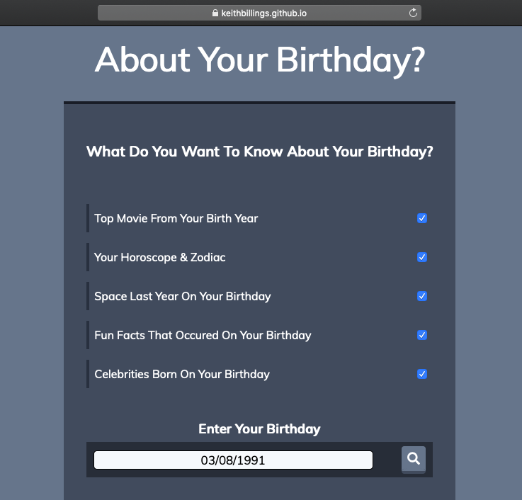
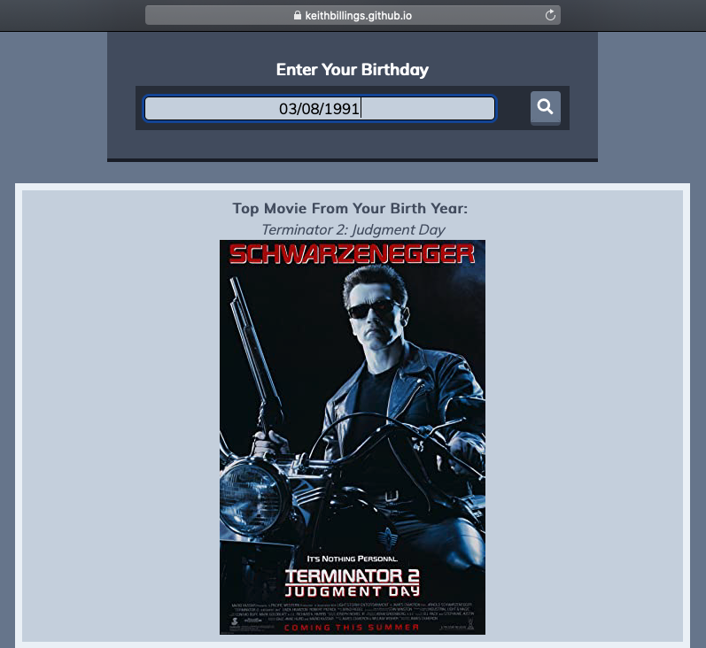
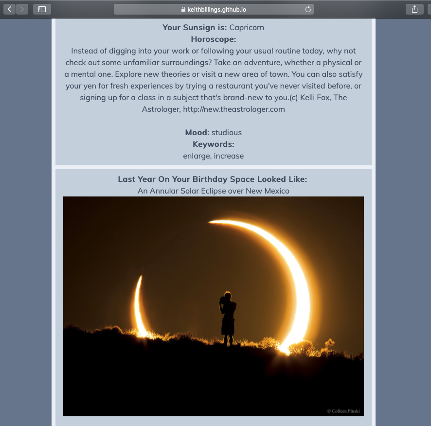
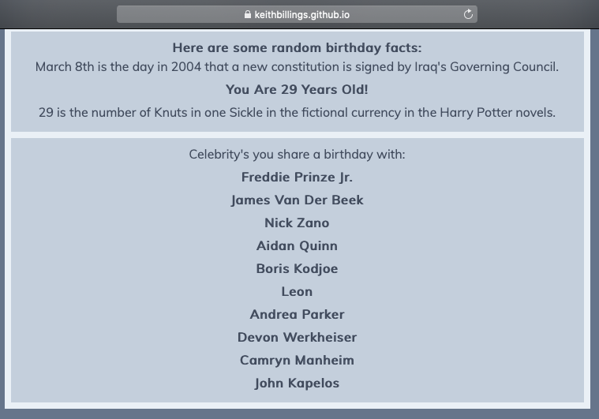
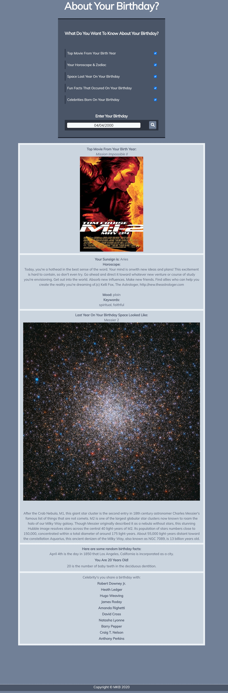

# Project 1: About-Your-Birthday
#### By: Keith Billings, Mark Kelly, and Brian Soldani

This was our first class assignment involving teams. The class was divided into groups of 3-4 members and we were allowed to research and come up with our own project to work on. Since this was our first team assignment, and our first self directed project, our team quickly decided that the project must be something fun and entertaining. It didn't take much time to focus on a topic that everyone could relate to; Birthdays! 

### URL of Deployed Application + Images

 https://keithbillings.github.io/About-Your-Birthday/

- Application home screen:

 

- First entertainment item:

 

- Horoscope information:

 

- Number facts based on your Birth Date and Age plus Celebrities you share a Birthday with:

 

## Project Details
The project needed to center around the use of at least two server-side APIs. We needed to incorporate at least one new CSS framework that we had not used in class before. Additionally, we had to use at least one new third-party API to go along with our polished UI that was free from using alerts, confirms, or prompts. As usual, the final product needed to meet good quality coding standards and be deployed in GitHub.

The deployed application consists of the following:

 - Clean and polished user interface.
 - Interactive checkboxes that display content chosen by the user.
 - Ability for the user to enter a date in MM/DD/YYYY format and get specific results.
 - Search results present user with various media types; text/image/video.
 - Content choices are a mix of entertainment and facts.
 - Multiple third-party APIs are used:
        * Numbers API
        * NASA API
        * GitHub Celebrity Birthdays API
        * Horoscopes API
 - Tailwinds CSS Framework is used in addition to CSS3, Jquery, AJAX, and Javascript. 
 
 
 
 ## Results
 The final application meets and exceeds all of the project requirements. We used several APIs and worked through the various issues we ran into with CORS errors. The application is a smooth, clean and polished product primed for future development. One of our goals was to make the product modular so that it can be improved and built upon in the future. While this is currently a fully functional application in its current state, there are still plenty of additional features we can add to make it more useful in the future. Suggested add-ons would include; local bands in town, party/event planning, reservation booking, and funny/sarcastic versions of the application. 

### Team, Roles, and Responsibilities

**Mark** - Lead Front-end, UI, CSS Framework, Troubleshoot, JS, KanBan

**Brian** - Whitepaper, JS, API keys, API calls, Presentation Slides, Troubleshoot

**Keith** - Setup GitHub, Lead Back-end, JS, API keys, API calls, Troubleshoot

### Full size application image

